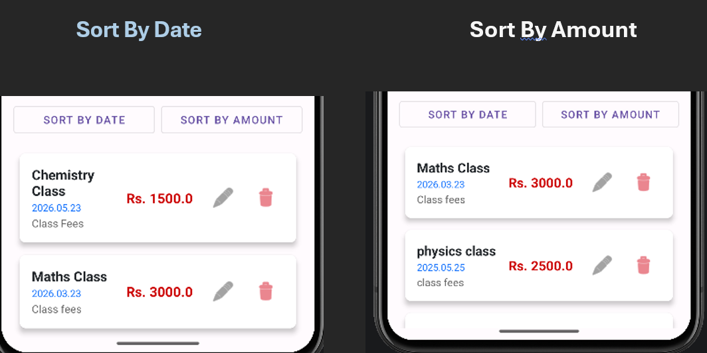

ඔයාගේ ඇත්තම GitHub ලින්ක් එක පාවිච්චි කරලා මම සම්පූර්ණ `README.md` කෝඩ් එක අප්ඩේට් කළා.

Installation කොටසේ තියෙන `git clone` කමාන්ඩ් එක වගේම, ෆෝල්ඩර් වල නම් (CoinSync වෙනුවට PersonalExpenseTracker) හැමදෙයක්ම මේකට ගැළපෙන්නම මම වෙනස් කරලා තියෙනවා.

මේ සම්පූර්ණ කෝඩ් එක කොපි කරලා ඔයාගේ `README.md` ෆයිල් එකට දාලා සේව් කරන්න.

```markdown
# 💰 Personal Expense Tracker (CoinSync)

### Advanced Personal Finance & Cloud Synchronization System

> **Scope:** A robust, offline-first Android application for efficient personal financial management, featuring seamless local data persistence and secure cloud-based disaster recovery.

CoinSync is a full-fledged native Android application designed to help users accurately track their daily expenses, organize them into custom categories, and secure their financial data. The system utilizes **Room Database** for high-speed offline operations and integrates **Firebase Cloud Firestore** for reliable data backup and restoration.

---

## 🎓 Academic Project Details
* **University:** General Sir John Kotalawela Defence University
* **Degree:** BSc (Hons) in Computer Engineering
* **Module:** Mobile Computing - COE21022
* **Author:** H.A.T.S Ariyarathna - D/BCE/24/0010

---

## 📸 System Previews & Features

### 1. Dynamic Dashboard & Quick Add
The application features a dynamic home screen where users can instantly add new records via the Quick Add form. Users can also create custom expense groups (e.g., Daily Expenses, Class Fees) with real-time record counters.


### 2. Live Search Functionality
Navigate through large amounts of data effortlessly. The built-in live search allows users to filter multiple expense groups directly from the dashboard, or search for specific item titles inside a particular category.

<br>


### 3. Comprehensive Expense Tracking & Smart Sort
View detailed transaction lists with full CRUD (Create, Read, Update, Delete) support. Users can dynamically organize their financial data by clicking the "Sort By Date" (chronological order) or "Sort By Amount" (highest to lowest spending) toggles.

<br>


### 4. Hybrid Cloud Synchronization
Ensures financial history is never lost. Users can safely serialize their local SQLite data and push it to Google Cloud with a single tap. Toast notifications provide real-time feedback during the backup process.

<br>


---

## 📁 Project Structure

```text
PersonalExpenseTracker/
├── app/
│   ├── manifests/                                   # Application manifest
│   ├── src/main/java/com/tharusha/expensetracker/   # Kotlin Source Code
│   │   ├── AppDatabase.kt                           # Room Database setup & initialization
│   │   ├── Expense.kt                               # Data Class / Room Entity for Expenses
│   │   ├── ExpenseAdapter.kt                        # RecyclerView Adapter for rendering lists
│   │   ├── ExpenseDao.kt                            # Data Access Object (SQLite Queries)
│   │   ├── ExpenseGroup.kt                          # Data Class / Room Entity for Groups
│   │   ├── ExpenseListActivity.kt                   # UI Logic: Expense CRUD & Sorting
│   │   └── MainActivity.kt                          # UI Logic: Dashboard & Firebase Sync
│   ├── src/main/res/                                # UI Resources
│   │   ├── drawable/                                # Icons, vectors, and custom shapes
│   │   ├── layout/                                  # XML UI Layouts
│   │   │   ├── activity_expense_list.xml
│   │   │   ├── activity_main.xml
│   │   │   └── item_expense.xml
│   │   ├── mipmap/                                  # App launcher icons
│   │   ├── values/                                  # Resource values
│   │   │   ├── colors.xml                           # App color palette
│   │   │   ├── strings.xml                          # Text constants
│   │   │   └── themes/                              # App styling (Light/Dark themes)
│   │   └── xml/                                     # Additional XML configurations
│   └── google-services.json                         # Firebase backend configuration file
└── Gradle Scripts/                                  # Project & Module build dependencies

```

---

## 🛠️ Prerequisites

| Requirement | Details |
| --- | --- |
| **IDE** | Android Studio (Latest Version) |
| **Language** | Kotlin |
| **SDK** | Android SDK API 24 or higher |
| **Backend** | Firebase Account (For Cloud Firestore setup) |

---

## 🚀 Setup & Installation

### 1. Clone the project

```bash
git clone [https://github.com/tharusha0010/PersonalExpenseTracker.git](https://github.com/tharusha0010/PersonalExpenseTracker.git)
cd PersonalExpenseTracker

```

### 2. Open in Android Studio

Launch Android Studio, select **Open**, and navigate to the cloned `PersonalExpenseTracker` directory. Allow the Gradle sync process to complete automatically (Internet connection required).

### 3. Connect to Firebase (Crucial Step)

To enable the Cloud Backup/Restore feature:

1. Go to the [Firebase Console](https://console.firebase.google.com/) and create a new project.
2. Register your Android app using the package name (`com.tharusha.expensetracker`).
3. Download the `google-services.json` file.
4. Place the downloaded file inside the `app/` directory of this project.
5. In Firebase, enable **Firestore Database** and set the security rules to `allow read, write: if true;` for testing purposes.

---

## 🏗️ Architecture

```text
User Interaction (Android UI)
        │
        ▼
┌───────────────────────────────────┐
│     Asynchronous Processing       │
│ Kotlin Coroutines (Dispatchers.IO)│
│ → Ensures Non-blocking Main Thread│
└─────────────────┬─────────────────┘
                  ▼
┌───────────────────────────────────┐
│     Local Persistence (Room)      │
│  SQLite Database + DAO Interfaces │
│  → Fast Offline CRUD Operations   │
└────────┬─────────────────┬────────┘
         │                 │
      Backup            Restore
         │                 │
         ▼                 ▼
┌───────────────────────────────────┐
│    Disaster Recovery (Cloud)      │
│    Firebase Cloud Firestore       │
│  → Remote NoSQL Synchronization   │
└───────────────────────────────────┘

```

---

## 📦 Dependencies

| Package | Purpose |
| --- | --- |
| `androidx.room:room-ktx` | Local SQLite database management |
| `com.google.firebase:firebase-firestore-ktx` | Cloud database for backup and restore |
| `org.jetbrains.kotlinx:kotlinx-coroutines-android` | Background thread and asynchronous operations |
| `com.google.android.material:material` | Modern UI components and layouts |

```

```